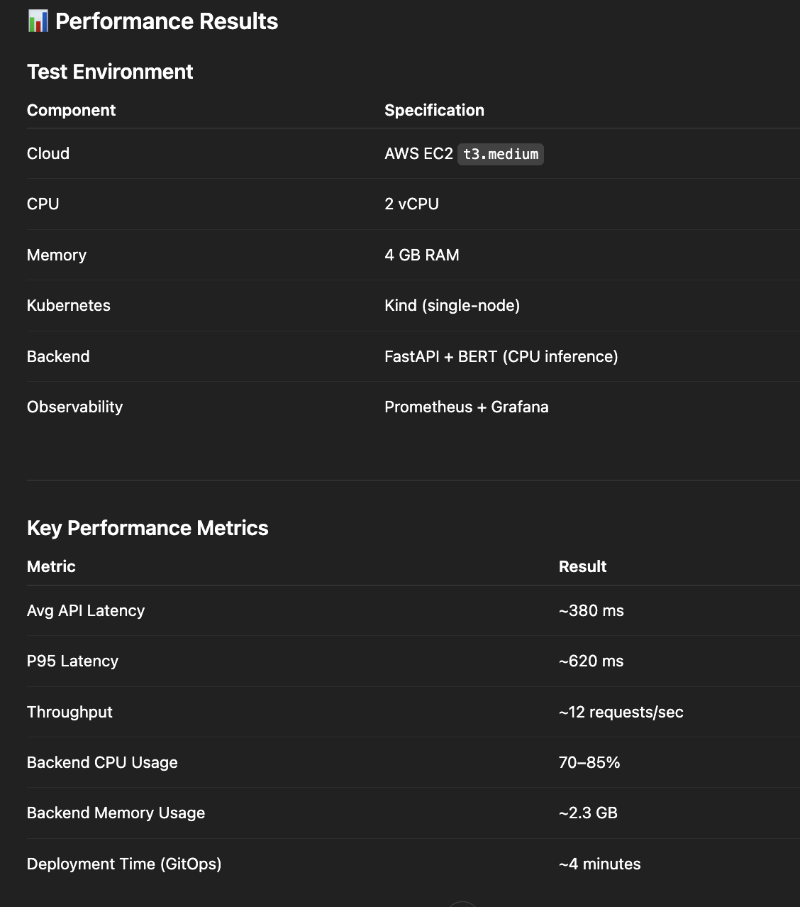

# 🕵️‍♂️ AI-Powered Fake News Detector

A high-performance, cloud-native application that leverages **Deep Learning (BERT)** to detect misinformation in real-time. ⚡

Built on a production-grade **Kubernetes** stack with fully automated **GitOps** delivery. 🚀

## 📊 Performance Results

## 🏗️ Architecture

## 📖 Chapters

* [**BERT Classifier Core Logic**](docs/01_bert_classifier_core_logic_.md)  
  Core NLP pipeline, text preprocessing, BERT inference flow, and classification logic.
* [**Confidence-Aware Prediction Logic**](docs/02_confidence_aware_prediction_logic_.md)  
  Confidence scoring, thresholding strategy, and decision logic for predictions.
* [**FastAPI Backend & API Gateway**](docs/03_fastapi_backend___api_gateway_.md)  
  REST API design, request lifecycle, backend architecture, and service communication.
* [**Cloud Model Management (S3 MLOps)**](docs/04_cloud_model_management__s3_mlops__.md)  
  Model artifact storage in Amazon S3, versioning strategy, and runtime model loading.
* [**Observability Stack (Prometheus & Grafana)**](docs/05_observability_stack__prometheus___grafana__.md)  
  Metrics collection, monitoring dashboards, and system visibility.
* [**Kubernetes Kind & Ingress Layer**](docs/06_kubernetes_kind___ingress_layer_.md)  
  Cluster setup using Kind, NGINX Ingress configuration, and traffic routing.
* [**ArgoCD GitOps Configuration**](docs/07_argocd_gitops_configuration_.md)  
  GitOps workflow, ArgoCD sync strategy, deployment automation, and rollback handling.
* [**Terraform AWS Provisioning**](docs/08_terraform_aws_provisioning_.md)  
  Infrastructure provisioning on AWS EC2, networking basics, and IaC structure.
* [**Ansible Configuration Management**](docs/09_ansible_configuration_management.md)  
  Automated server setup, installing Docker/Kind/Kubectl via playbooks.

