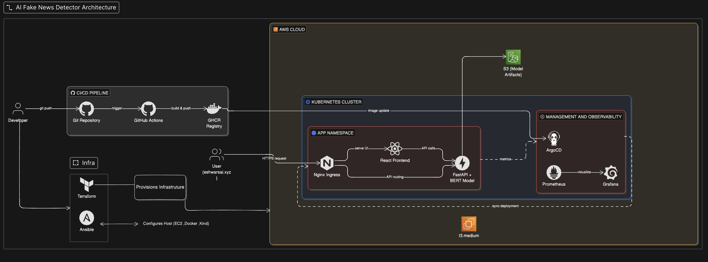

# AI-Powered Fake News Detector

A high-performance, cloud-native application that leverages Deep Learning (BERT) to detect misinformation in real-time. Built on a production-grade Kubernetes stack with fully automated GitOps delivery.

## 🏗️ Architecture

## 📖 Documentation

*   [**CI/CD Pipeline**](docs/01_cicd_pipeline.md) - GitHub Actions & Container Registry workflows.
*   [**GitOps Delivery**](docs/02_gitops_with_argocd.md) - Automated synchronization via ArgoCD.
*   [**Kubernetes Infrastructure**](docs/03_kubernetes_architecture.md) - Cluster design on AWS EC2 (Kind).
*   [**Application Workflow**](docs/04_application_workflow.md) - Frontend-Backend interaction and routing.
*   [**Observability**](docs/05_observability_monitoring.md) - Prometheus & Grafana monitoring stack.
*   [**ML Inference Engine**](docs/06_ml_backend_inference.md) - BERT model serving and optimization.
