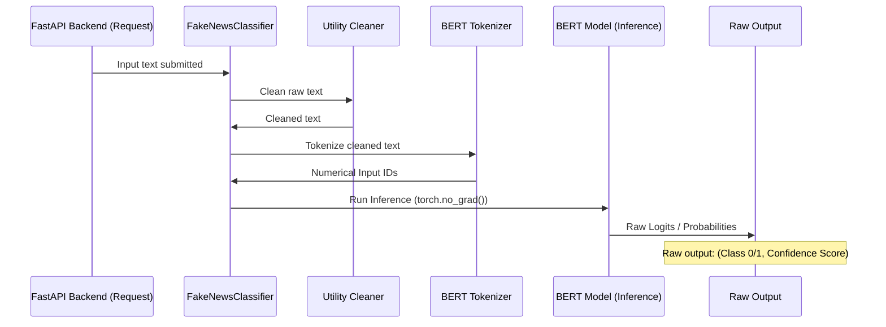

# Chapter 1: BERT Classifier Core Logic

Welcome to the heart of the AI-powered Fake News Detector! In this first chapter, we will look at the core intelligence component—the engine that reads a news article and decides if it looks real or fake.

This component is built around **BERT**, a complex deep learning model. Our goal here is not to understand how BERT works internally (that takes books!), but how we manage it in our Python application to make instant predictions. We call this the **BERT Classifier Core Logic**.

## 1. What Problem Does the Core Logic Solve?

Imagine a user pastes a news article into our web application and clicks "Analyze."

**The Problem:** Raw text is useless to a complex AI model. The AI needs a fast, standardized way to process the text and generate a prediction without disrupting the rest of the application.

**The Solution:** The `FakeNewsClassifier` component handles this. It acts as the gatekeeper, performing three vital steps:

| Step | Goal | Why it Matters |
| :--- | :--- | :--- |
| **1. Loading** | Get the massive BERT model into memory. | Ensures predictions are fast (milliseconds, not seconds). |
| **2. Preprocessing** | Clean the raw text (remove HTML, links, etc.). | Ensures the input is standardized and free of noise. |
| **3. Inference** | Run the cleaned text through BERT. | Generates the core output: a binary prediction (0 or 1) and a confidence score. |

---

## 2. Introducing the `FakeNewsClassifier`

In our project, all this core logic is bundled into a single Python class found in `backend/app/model.py`. This class is responsible for loading the model only **once** when the application starts, which is critical for performance.

Let's look at the basic structure of this class:

```python
# backend/app/model.py (Simplified Structure)
class FakeNewsClassifier:
    
    def __init__(self):
        self.model = None
        self.tokenizer = None
        self.device = "cpu" 
        self._is_loaded = False
        
    def load(self) -> bool:
        # Load BERT from disk or the cloud (S3)
        # ... logic to find and load model files ...
        self._is_loaded = True
        return True
    
    def predict_news_final(self, text: str) -> Tuple[str, float]:
        # Handle cleanup, tokenization, and prediction
        # ... core prediction logic ...
        pass
```

### 2.1. Loading the Brain (The `load()` method)

The `load()` method is the first thing that runs when our service starts. It uses tools from the powerful `transformers` library (made by Hugging Face) to find and load our specialized BERT model.

Crucially, because this application runs in the cloud, the `load()` method first checks the local disk. If the model is missing (e.g., this is the first time the container is starting), it has built-in logic to download the model from cloud storage (S3 MLOps).

```python
# Snippet from FakeNewsClassifier.load()
from transformers import AutoTokenizer, AutoModelForSequenceClassification

def load(self):
    # Check if files exist locally. If not, download from S3.
    if not self._model_exists_locally():
        download_model_from_s3(...) # Covered later in S3 chapter
        
    # Load BERT components
    model_path = "saved_model/fake-news-bert"
    
    # 1. Load the Tokenizer (the text reader)
    self.tokenizer = AutoTokenizer.from_pretrained(model_path)
    
    # 2. Load the Model (the brain)
    self.model = AutoModelForSequenceClassification.from_pretrained(model_path)
    
    # Set the model to "evaluation mode" (read-only)
    self.model.eval() 
    self._is_loaded = True
    print("Model loaded and ready!")
```

## 3. The Inference Pipeline: Text to Prediction

Once the model is loaded, the `predict_news_final(text)` method handles the actual classification. This is a sequence of highly optimized steps.

### 3.1. Step 1: Cleaning the Text

Raw web data can contain HTML tags, embedded links, or weird formatting. We must clean this up so BERT only sees the essential text. This is handled by a helper function in `backend/app/utils.py`.

```python
# backend/app/utils.py (Cleaning)
import re
import html

def clean_text(text: str) -> str:
    # 1. Decode HTML entities (e.g., &amp; becomes &)
    text = html.unescape(text)
    
    # 2. Remove HTML tags (e.g., <b> text </b>)
    text = re.sub(r'<[^>]+>', '', text)
    
    # 3. Remove URLs
    text = re.sub(r'https?://\S+', '', text)
    
    # 4. Collapse extra whitespace and trim edges
    text = re.sub(r'\s+', ' ', text).strip()
    
    return text
```

### 3.2. Step 2: Tokenization (Teaching BERT to Read)

BERT doesn't read English words; it reads numbers (tokens) that represent words or sub-words. The tokenizer converts the cleaned text into a sequence of ID numbers that BERT expects, making sure the input is truncated to BERT's maximum length (512 tokens).

```python
# Snippet from FakeNewsClassifier.predict_news_final()
cleaned_text = clean_text(text)

# Convert text to numerical inputs (PyTorch format)
inputs = self.tokenizer(
    cleaned_text,
    return_tensors="pt",  # Use PyTorch tensors
    truncation=True,      # Cut off if too long
    max_length=512,       # Max size for BERT
    padding=True
)

# Move inputs to the designated device (CPU in our case)
inputs = {k: v.to(self.device) for k, v in inputs.items()}
```

### 3.3. Step 3: Running Inference

With the numerical inputs ready, we feed them into the BERT model.

We use `torch.no_grad()`. This is an important optimization! It tells PyTorch, "We are only predicting now, not training, so don't bother calculating gradients." This saves memory and makes the prediction much faster.

```python
# Snippet from FakeNewsClassifier.predict_news_final()

# Optimization: Disable gradient tracking
with torch.no_grad():
    # Run the numerical inputs through the model
    outputs = self.model(**inputs) 
    logits = outputs.logits
    
    # Convert raw output (logits) into smooth probabilities (0.0 to 1.0)
    probabilities = torch.softmax(logits, dim=-1)
    
    # Find the class with the highest probability (0 or 1)
    predicted_class = torch.argmax(probabilities, dim=-1).item()
    
    # Get the confidence score for that class
    confidence = probabilities[0][predicted_class].item()

# Raw output example: (1, 0.98) -> Fake, 98% confidence
```

## 4. The Core Logic Flow

To summarize, here is the full path a raw news article takes to become a raw prediction and confidence score:



This sequence diagram illustrates that the `FakeNewsClassifier` orchestrates everything: cleaning, tokenizing, running the model, and extracting the raw results.

---

## Conclusion and Next Steps

We have successfully established the "brain" of our detector. We learned how the `FakeNewsClassifier` loads the powerful BERT model once, and then, for every API request, it performs quick preprocessing, tokenization, and inference to generate a numerical raw classification (0 or 1) and a confidence score.

However, simply saying "Fake, 51% confidence" isn't helpful. If the model is only 51% sure, we shouldn't trust it fully. In the next chapter, we will build smart, confidence-aware business rules on top of this raw output to handle ambiguous cases gracefully, introducing the category of "Uncertain."

[Chapter 2:Confidence-Aware Prediction Logic](02_confidence_aware_prediction_logic_.md)

---