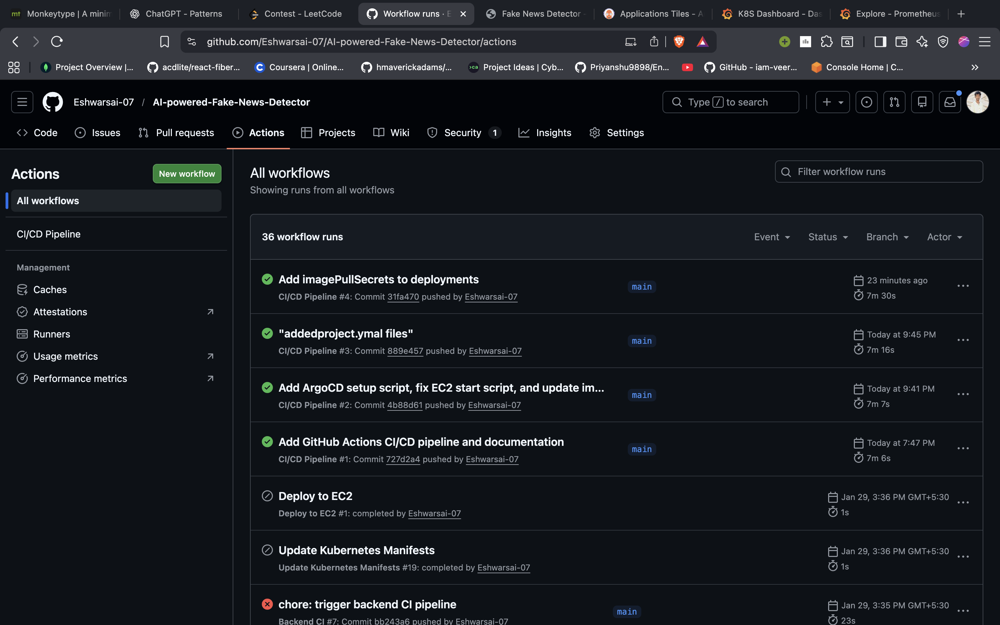

# CI/CD Pipeline

## Overview
The Continuous Integration and Continuous Delivery (CI/CD) pipeline ensures that every code change is automatically tested, built, and pushed to the container registry without human intervention. This establishes a reliable supply chain for the application.

## Workflow Mechanics

### 1. Source Control Trigger
*   **Event**: Push to `main` branch.
*   **Scope**: Monorepo structure containing both `backend/` and `frontend/` source code.

### 2. GitHub Actions Runner
The pipeline executes on a managed runner with the following stages:
*   **Build**: Docker images are constructed using multi-stage builds to minimize image size.
*   **Tagging**: Images are tagged with both `latest` and `sha-<commit-hash>` for immutability and precise rollback capabilities.
*   **Push**: Authenticated push to GitHub Container Registry (GHCR).

### 3. Artifact Registry (GHCR)
*   Acts as the central repository for all immutable deployment artifacts.
*   Public visibility ensures the Kubernetes cluster can pull images without complex secret management for this public demo.

## Key Design Decisions
*   **Separation of Concerns**: Backend and Frontend have distinct build contexts but share a unified pipeline for atomicity.
*   **Security**: No secrets are baked into images; environment inputs are injected at runtime.
