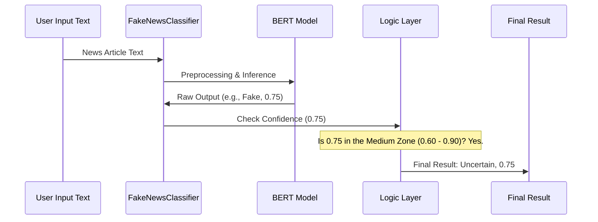

# Chapter 2: Confidence-Aware Prediction Logic

Welcome back! In [Chapter 1: BERT Classifier Core Logic](01_bert_classifier_core_logic_.md), we built the core engine, the `FakeNewsClassifier`, which uses the powerful BERT model to produce a **raw prediction** (0 or 1) and a **confidence score** (e.g., 98% or 51%).

While a 98% confident prediction is great, what happens when the model is only 51% sure? We shouldn't treat that weak guess as fact.

This is the problem we solve in Chapter 2: We wrap the raw AI output with a layer of smart business rules. We call this the **Confidence-Aware Prediction Logic**.

## 1. Why We Need a "Guardrail"

Imagine you are using a self-driving car. If the car is 99% sure it sees a green light, it goes. If it's 99% sure it sees a red light, it stops.

But what if the camera is blurry, and the car is only 55% sure it sees *something*? If the car were designed simply to pick the highest percentage, it might weakly decide to go (55% > 45%) and cause an accident.

**Our Goal:** To stop our Fake News Detector from making high-stakes decisions when it feels uncertain. We introduce a third, responsible category: **"Uncertain."**

## 2. Defining the Confidence Zones

To implement this "Uncertain" category, we define clear boundaries or **thresholds** for the model's confidence score (which is a number between 0.0 and 1.0, or 0% and 100%).

We use two key thresholds, defined in `backend/app/model.py`:

| Zone | Confidence Range | Prediction Outcome | Description |
| :--- | :--- | :--- | :--- |
| **High** | Above 90% (0.90) | Accepted (Real or Fake) | The model is highly certain. We trust the raw prediction. |
| **Medium**| 60% to 90% (0.60 to 0.90) | **Uncertain** | Ambiguous zone. We choose caution over prediction. |
| **Low** | Below 60% (0.60) | **Uncertain** | The model is essentially guessing. Always reject. |

In our code, these boundaries are simple variables:

```python
# backend/app/model.py (Simplified)
# Confidence thresholds for decision logic
CONFIDENCE_HIGH = 0.90      
CONFIDENCE_MEDIUM = 0.60    

def _apply_confidence_logic(prediction, confidence):
    # If above 90%, we trust it
    if confidence >= CONFIDENCE_HIGH:
        return prediction, confidence
    
    # If below 90% but above 60%, or below 60%,
    # we classify it as Uncertain
    elif confidence >= CONFIDENCE_MEDIUM:
        return "Uncertain", confidence
    
    else: # confidence < 0.60
        return "Uncertain", confidence
```

## 3. The New Prediction Flow

Instead of just returning the raw output from BERT, the `FakeNewsClassifier` now runs one final, critical step: the confidence check.

Let's see how the full pipeline has changed, focusing on the new decision stage:



### Example Cases

Here is how the logic changes the outcome based on the raw confidence:

| Raw Model Prediction | Confidence Score | Confidence Zone | Final Output |
| :--- | :--- | :--- | :--- |
| Fake | 0.95 (95%) | High | **Fake** |
| Real | 0.80 (80%) | Medium | **Uncertain** |
| Fake | 0.55 (55%) | Low | **Uncertain** |
| Real | 0.92 (92%) | High | **Real** |

## 4. Implementing the Logic in Code

The logic we just discussed is implemented inside a method called `_apply_confidence_logic` within our main classifier class in `backend/app/model.py`.

The primary public method, `predict_news_final`, orchestrates the entire process, including this new guardrail.

```python
# backend/app/model.py (Snippet from predict_news_final)

def predict_news_final(self, text: str):
    # ... Steps 1-5: Input Validation, Preprocessing, Inference ...
    # (These steps produce raw_prediction and confidence)
    
    # Example: model output is ("Real", 0.78)
    raw_prediction = "Real" 
    confidence = 0.78
    
    # Step 6: Apply confidence-aware decision logic
    final_prediction, final_confidence = self._apply_confidence_logic(
        raw_prediction, 
        confidence, 
        is_headline=False # Simplified for this example
    )
    
    # final_prediction will be "Uncertain"
    # final_confidence will be 0.78
    
    return final_prediction, round(final_confidence, 4)
```

### Dealing with Headlines

The full logic is even smarter. If the input text is very short (like a single headline), it is often more ambiguous than a full article. To be extra cautious, the system applies an even **stricter** confidence threshold (e.g., 95% instead of 90%) if it detects the input is only a headline.

The `FakeNewsClassifier` uses a small helper function, `_is_headline_only`, to figure this out:

```python
# backend/app/model.py (Headline Check)
import re

def _is_headline_only(self, text: str) -> bool:
    """Detect if input is likely just a headline."""
    word_count = len(text.split())
    
    # Count sentence endings (. ! ?)
    sentence_endings = len(re.findall(r'[.!?]', text))
    
    # If very short (e.g., < 15 words) and no clear sentence structure
    if word_count < 15 and sentence_endings == 0:
        return True
    
    return False 
```

This ensures we don't accidentally label a sensational but short headline as "Fake" unless the model is extremely certain.

## Conclusion and Next Steps

By implementing the **Confidence-Aware Prediction Logic**, we have transformed our AI model from a simple number-cruncher into a responsible component that knows when to admit, "I don't know." This crucial guardrail improves the reliability of our system, especially when dealing with ambiguous or poorly structured inputs.

Now that we have a robust, reliable AI component, the next step is to make it accessible to the outside world! In the next chapter, we will wrap our `FakeNewsClassifier` in a high-speed web application using FastAPI.

[Chapter 3: FastAPI Backend & API Gateway](03_fastapi_backend___api_gateway_.md)
---