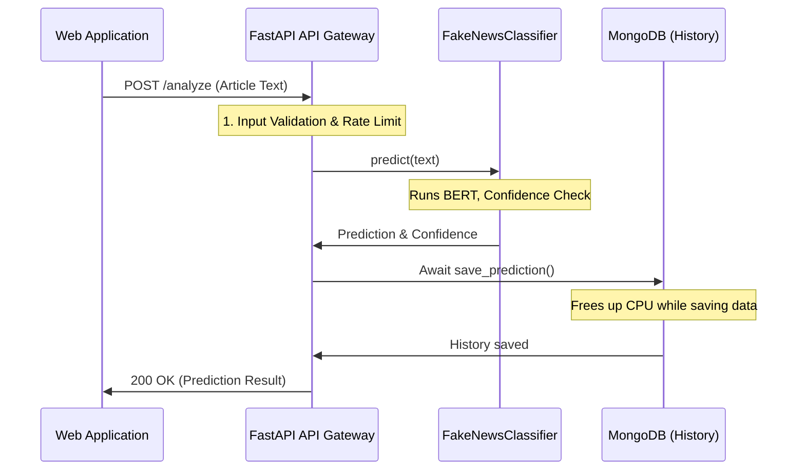

# Chapter 3: FastAPI Backend & API Gateway

Welcome to Chapter 3! In the previous chapters, we built the intelligent core: the [BERT Classifier Core Logic](01_bert_classifier_core_logic_.md) (Chapter 1) and the [Confidence-Aware Prediction Logic](02_confidence_aware_prediction_logic_.md) (Chapter 2).

We now have a reliable, internal Python class that can analyze text. But how does this AI brain talk to the outside world—like a user's web browser?

The answer is the **FastAPI Backend**, which acts as a protective **API Gateway** for our application.

## 1. What Problem Does FastAPI Solve?

The core problem is transforming our internal Python function, `classifier.predict(text)`, into a fast, secure, and accessible web service.

Imagine a user types text into a website and clicks "Analyze."

**The Solution:** We use **FastAPI** to create a structured entry point (an API endpoint). This service wraps the AI logic and also performs all the necessary "production readiness" tasks that keep the system stable and safe.

| Role | Responsibility | Why it Matters |
| :--- | :--- | :--- |
| **FastAPI Backend** | Expose functions as HTTP endpoints (e.g., `/analyze`). | Allows the frontend website to communicate with the AI logic. |
| **API Gateway** | Validate requests, limit traffic, save history. | Protects the expensive AI model and maintains system integrity. |

## 2. Setting Up the Service Hub

Our entire backend application logic lives within a FastAPI instance defined in `backend/app/main.py`.

### 2.1. Defining Endpoints

FastAPI uses Python decorators (`@app.post`, `@app.get`) to define web routes. We focus on three main endpoints:

1.  **`/analyze` (POST):** The core service. Takes news text, returns prediction and confidence.
2.  **`/history` (GET):** Retrieves the list of recent analyses from the database.
3.  **`/health` (GET):** Simple check to see if the service is alive and the model is loaded.

### 2.2. Ensuring Input Safety (Pydantic Validation)

Before we feed any user text into our powerful BERT model, we must ensure the input is valid. FastAPI uses **Pydantic** models (found in `backend/app/schemas.py`) for automatic data validation.

This prevents common issues like trying to analyze an empty string or a text block that is far too large.

```python
# backend/app/schemas.py (Analyze Request)
from pydantic import BaseModel, Field

class AnalyzeRequest(BaseModel):
    """Schema for the text analysis request."""
    
    text: str = Field(
        ...,
        min_length=10, # Must be at least 10 characters
        max_length=10000, # Must be shorter than 10k characters
        description="The news article text to analyze"
    )

class AnalyzeResponse(BaseModel):
    """Schema for the prediction result."""
    prediction: str # 'Fake', 'Real', or 'Uncertain'
    confidence: float # Score 0.0 to 1.0
```

If a user sends text shorter than 10 characters to the `/analyze` endpoint, FastAPI automatically intercepts the request and sends a polite error message *before* the request even touches the BERT classifier, saving precious computational time.

## 3. The Need for Speed: Asynchronous Operations

Running the BERT model is fast, but saving the result to the MongoDB database (persistence) takes time. If our server had to wait for the database every time, it could only handle one user request at a time.

This is where **Asynchronous I/O** comes in, using Python's `async` and `await` keywords.

When the API saves data to the database, we use the `await` keyword. This tells FastAPI: "The CPU doesn't need to work now; the database connection is busy. Go and handle the next user's request while we wait for the database to finish."

This capability is why FastAPI is incredibly fast and highly concurrent. We use **Motor**, the asynchronous driver for MongoDB, to make this possible.

```python
# backend/app/main.py (The main endpoint)
@app.post("/analyze", response_model=AnalyzeResponse)
async def analyze_text(request: AnalyzeRequest, req: Request):
    # ... Validation, Rate Limiting ...

    # 1. Prediction (CPU-bound)
    prediction, confidence = classifier.predict(request.text)
    
    # 2. History Save (I/O-bound - we MUST await this)
    if mongodb.is_connected:
        await mongodb.save_prediction(
            text=request.text,
            prediction=prediction,
            confidence=confidence,
            model_version="v1" 
        )
    
    return AnalyzeResponse(prediction=prediction, confidence=confidence)
```

The `await` line ensures that saving the history doesn't slow down the entire service, guaranteeing high throughput for many users simultaneously.

## 4. The Lifecycle of the API Gateway

The heaviest task in our system is loading the massive BERT model into memory (as discussed in [Chapter 1: BERT Classifier Core Logic](01_bert_classifier_core_logic_.md)). We only want to do this **once** when the service starts up, not for every user request.

FastAPI manages this through a concept called **Lifespan Management** (`asynccontextmanager` in `main.py`).

```python
# backend/app/main.py (Simplified Lifespan)
from contextlib import asynccontextmanager

@asynccontextmanager
async def lifespan(app: FastAPI):
    # --- 1. Startup Logic ---
    print("Starting up - Loading ML model...")
    classifier.load() # Loads BERT (CPU intensive)
    
    print("Connecting to MongoDB...")
    await mongodb.connect() # Connects DB (I/O intensive)
    
    yield  # <-- Application is running here
    
    # --- 2. Shutdown Logic ---
    print("Shutting down...")
    await mongodb.disconnect()
```
By loading the model in the `lifespan` startup phase, every subsequent request hits an already loaded, lightning-fast classifier.

## 5. Gateway Function: Protection and Persistence

As an API Gateway, our FastAPI service enforces important rules to keep the application reliable:

### 5.1. Rate Limiting

To prevent a single bad actor from flooding the API and exhausting the ML resources, we implement a basic rate limiter that checks the user's IP address.

```python
# backend/app/main.py (Simplified Rate Limit Check)
rate_limit_store = defaultdict(list)

def is_rate_limited(client_ip: str) -> bool:
    # Check how many requests this IP made in the last 60 seconds
    # RATE_LIMIT_REQUESTS = 10
    if len(rate_limit_store[client_ip]) >= 10:
        return True
    
    # Allow the request and record it
    rate_limit_store[client_ip].append(time.time())
    return False

# In the /analyze endpoint:
# if is_rate_limited(client_ip):
#     raise HTTPException(status_code=429, detail="Too many requests.")
```

### 5.2. Persistence (History)

The API gateway handles saving the successful prediction and confidence score into MongoDB (using the asynchronous `Motor` driver discussed earlier) so users can retrieve their analysis history via the `/history` endpoint.

## 6. Full Analysis Flow

This diagram illustrates how the FastAPI Gateway orchestrates the request from the user, through the AI model, and into the database, all while remaining highly concurrent.



## Conclusion and Next Steps

We have successfully wrapped our core AI logic in a high-performance, asynchronous FastAPI backend that acts as a robust API Gateway. It handles input safety, rate limiting, persistence to MongoDB, and ensures maximum concurrency by using `async` operations.

But where does the actual BERT model file come from when the service first starts up in the cloud? In the next chapter, we address the critical infrastructure piece of managing our large model files using cloud storage (S3) and establishing MLOps practices.

[Chapter 4: Cloud Model Management (S3 MLOps)](04_cloud_model_management__s3_mlops__.md)

---
