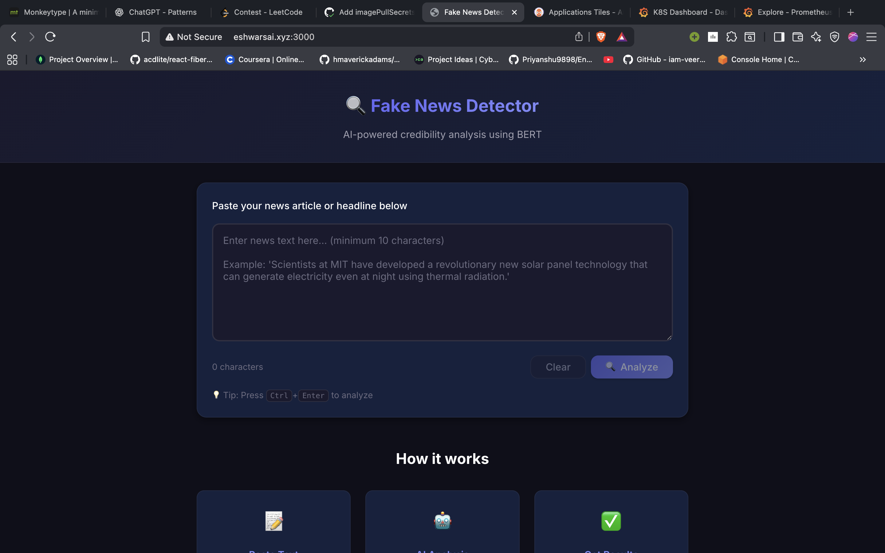

# Application Workflow

## Overview
The application follows a standard 3-tier web architecture designed for scalability and separation of concerns. The frontend is decoupled from the backend, communicating strictly via REST APIs.

*(Frontend User Interface)*

## Component Interaction

### 1. Frontend (React)
*   **Role**: Serves the User Interface and manages client-side state.
*   **Serving**: Hosted via Nginx container for high-performance static asset delivery.
*   **Routing**: Sends analysis requests to the backend endpoint `/predict`.

### 2. Ingress Layer
*   **Routing**: Nginx Ingress Controller intercepts external traffic.
*   **Rules**:
    *   `/` -> Forwards to `frontend-service` (Port 80)
    *   `/api` -> Forwards to `backend-service` (Port 8000)

### 3. Backend (FastAPI)
*   **Role**: API Gateway and ML Inference orchestration.
*   **Processing**: Receives news text, preprocesses it, and passes it to the loaded BERT model.
*   **Response**: Returns likelihood scores (Real vs Fake) and confidence metrics to the frontend.
