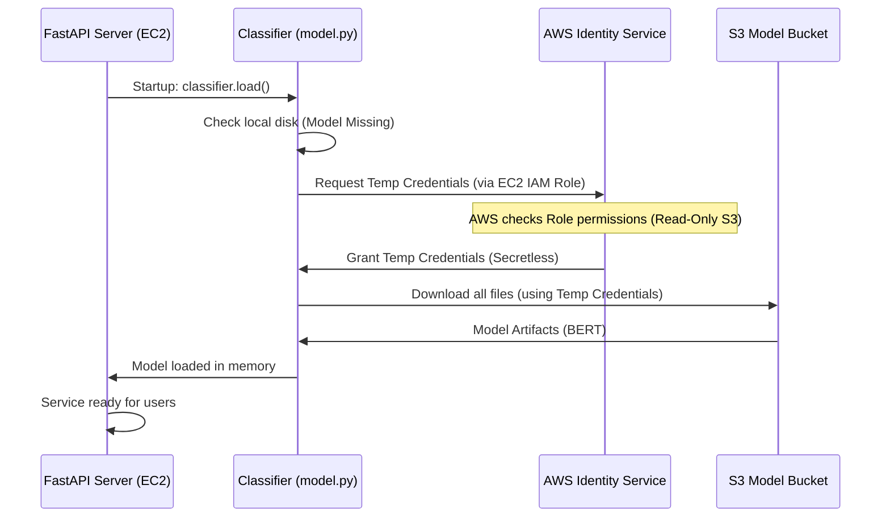

# Chapter 4: Cloud Model Management (S3 MLOps)

Welcome to Chapter 4! In the previous chapters, we built the intelligence core—the BERT Classifier—and wrapped it in a blazing-fast FastAPI web service ([Chapter 3: FastAPI Backend & API Gateway](03_fastapi_backend___api_gateway_.md)).

Our service is now ready to run in the cloud, but there is one huge problem remaining: **The Model File.**

The trained BERT model artifact is hundreds of megabytes in size. We cannot package such a massive file directly inside our lightweight Docker container image. If we did, deploying and updating our service would be slow and expensive.

This chapter introduces **Cloud Model Management (S3 MLOps)**, the reliable and secure solution for handling large AI assets in production.

## 1. The Core Problem: Where Does the Brain Live?

When our FastAPI service starts up on a cloud server (like an EC2 instance), it immediately calls the `classifier.load()` function. This function needs to find the model files.

| Strategy | Problem | Solution |
| :--- | :--- | :--- |
| **Put in Docker Image** | Image size becomes huge (e.g., 2GB). Deployments are slow. | **Store externally** in the cloud. |
| **Store on Server Disk** | If the server crashes or restarts, the files are lost. | **Use Persistent Cloud Storage.** |

We choose **AWS S3 (Simple Storage Service)**, which is designed for storing large, durable files (called "objects"). Our workflow for MLOps (Machine Learning Operations) is simply moving the model artifact from the training environment to this centralized S3 storage.

## 2. Phase 1: Uploading the Model Artifact

The first step is moving the model files (the trained weights, configuration, and tokenizer) into a private S3 bucket.

This is typically done by the developer or an automation pipeline after the training process is complete. We use a simple script that relies on the AWS Command Line Interface (CLI):

```bash
# Simplified Model Upload Action
# We use 'sync' to copy files from local disk to S3
BUCKET_NAME="fake-news-models-bucket"
MODEL_PATH="models/bert-v1"

aws s3 sync saved_model/fake-news-bert/ \
s3://$BUCKET_NAME/$MODEL_PATH/

# Output:
# upload: saved_model/.../config.json to s3://.../models/bert-v1/config.json
# upload: saved_model/.../model.safetensors to s3://.../models/bert-v1/model.safetensors
```

This ensures that the model is securely stored and versioned (we tag it `bert-v1`), ready for deployment.

## 3. Phase 2: Zero-Secret Downloading (IAM Roles)

When the service starts up in the cloud, it needs permission to access our private S3 bucket to download the model.

**The Major Security Challenge:** How do we give the cloud server access to S3 without putting secret AWS keys (like a username/password) directly into the application code or environment variables?

### Introducing IAM Roles (The "Secretless Key")

We solve this using **AWS IAM Roles** (Identity and Access Management). An IAM Role is like a temporary ID badge assigned directly to the cloud server (EC2 instance).

1.  **Creation:** We create an IAM Role (using infrastructure code, covered in Chapter 8) that specifically grants **read-only** permission to *only* our model S3 bucket.
2.  **Assignment:** We attach this Role to the EC2 server when it starts.
3.  **Access:** When our Python code (using the `boto3` AWS library) tries to access S3, AWS automatically recognizes the EC2 server's IAM Role and grants temporary, limited access.

This is the foundation of **zero-secret security** in production: the application never sees any secret keys, eliminating a massive security risk.

## 4. The Model Download Logic in Code

The `FakeNewsClassifier` in `backend/app/model.py` is smart enough to handle this download process automatically.

When `load()` is called, it executes this logic:

```python
# backend/app/model.py (Simplified load() function)

def load(self) -> bool:
    # 1. Check if model files are already on the server disk
    if self._model_exists_locally():
        print("Model found locally. Loading...")
        # ... load model into memory ...
        return True
    
    # 2. If missing, download from S3
    else:
        print("Model missing. Downloading from S3...")
        
        # This function handles authentication using the IAM Role
        download_success = download_model_from_s3(
            local_path=MODEL_PATH,
            s3_bucket=S3_BUCKET, # Configured in k8s/backend/configmap.yaml
            s3_key=S3_MODEL_KEY,
            region=AWS_REGION
        )
        
        if not download_success:
            return False # Fail startup if we can't get the brain
            
        # 3. Now that files are local, load model into memory
        # ... load model into memory ...
        return True
```

### The `download_model_from_s3` Helper

The core magic happens inside `download_model_from_s3`. This function uses the `boto3` library to communicate with AWS S3. Since the EC2 instance has the IAM Role attached, `boto3` uses that identity automatically.

```python
# backend/app/model.py (Simplified download_model_from_s3)

def download_model_from_s3(local_path: str, s3_bucket: str, s3_key: str, region: str) -> bool:
    import boto3
    
    # Create S3 client. Boto3 automatically uses the attached IAM Role.
    s3_client = boto3.client('s3', region_name=region)
    
    # 1. List files in the S3 folder
    response = s3_client.list_objects_v2(Bucket=s3_bucket, Prefix=s3_key + '/')
    
    # 2. Loop through the list and download each file individually
    for obj in response['Contents']:
        s3_file_key = obj['Key']
        local_file_path = os.path.join(local_path, s3_file_key)
        
        print(f"Downloading {s3_file_key}...")
        s3_client.download_file(s3_bucket, s3_file_key, local_file_path)
    
    return True
```
This process is repeated every time the service starts and finds the model missing, ensuring that the service always has the correct, latest model artifact downloaded from our secure storage.

## 5. The Full Startup Flow Diagram

This diagram shows the critical startup sequence where the server gets its credentials and downloads the massive model file without requiring any secrets in the code:



## 6. Conclusion and Next Steps

We have successfully implemented a robust and secure MLOps practice for model management. By using S3 for artifact storage and AWS IAM Roles for secure, zero-secret access, we ensure that our application can reliably download the massive BERT model whenever a cloud server starts up, without increasing our Docker image size.

Now that our AI is running, we need to know *how well* it's running. In the next chapter, we will introduce the concept of **Observability**, setting up tools like Prometheus and Grafana to watch our application's performance and health in real-time.

[Chapter 5: Observability Stack (Prometheus & Grafana)](05_observability_stack__prometheus___grafana__.md)

---