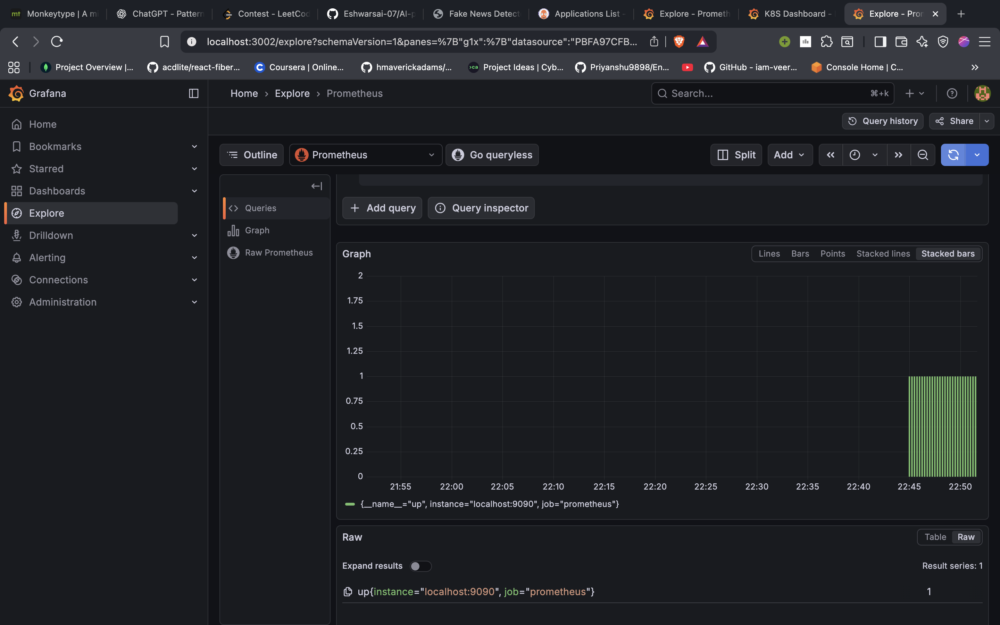

# Observability & Monitoring

## Overview
We implement a full observability stack to ensure system reliability. Monitoring is not an afterthought; it is integrated into the cluster to provide real-time metrics on resource usage and application health.

## The Monitoring Stack

### Prometheus (Metrics Collection)
*   **Role**: Time-series database that scrapes metrics from the cluster.
*   **Targets**: Configured to scrape Kubernetes nodes, Kubelet, and application pods annotated with `prometheus.io/scrape`.
*   **Retention**: Short-term retention optimized for live troubleshooting.

### Grafana (Visualization)
*   **Role**: Visualization dashboard connecting to Prometheus datasource.
*   **Dashboards**:
    *   **Cluster Health**: CPU/Memory pressure, Pod count.
    *   **Application Metrics**: Request latency, error rates, and throughput.

## Health Checks
*   **Liveness Probes**: Kubernetes restarts pods if the application deadlocks.
*   **Readiness Probes**: Traffic is only sent to pods that have fully loaded the ML model.
