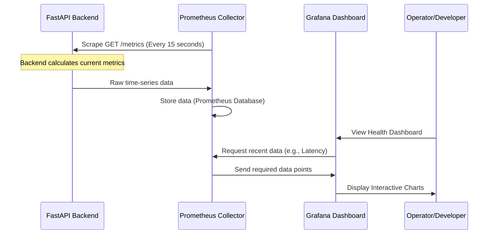

# Chapter 5: Observability Stack (Prometheus & Grafana)

Welcome to Chapter 5! We have successfully built our intelligent application, secured its loading process using [Cloud Model Management (S3 MLOps)](04_cloud_model_management__s3_mlops__.md), and wrapped it in a [FastAPI Backend & API Gateway](03_fastapi_backend___api_gateway_.md).

The service is running, but now we face a critical production question: **Is the service running *well*?**

If the prediction time suddenly slows down from 200 milliseconds to 5 seconds, or if the server starts running out of memory, we need to know instantly, ideally before any user complains.

This is the job of **Observability**, and we solve it using a dedicated system called the **Observability Stack**, featuring **Prometheus** and **Grafana**.

## 1. What is Observability and Why Do We Need It?

Observability is the ability to understand the internal state of a system just by looking at the data it outputs. It's like giving your application a constant health check.

| Health Check Type | Simple Service | Observability Stack |
| :--- | :--- | :--- |
| **Question** | Is the service alive? (Yes/No) | How many users are active? |
| **Question** | Did it crash? | How fast is the AI prediction time? |
| **Question** | Is the server overloaded? | How much CPU/memory is the BERT model using right now? |

To answer these detailed questions, we rely on **metrics**—numerical measurements recorded over time.

## 2. Introducing the Observability Stack

Our stack consists of two primary, highly popular open-source tools that work together perfectly:

| Tool | Role | Analogy |
| :--- | :--- | :--- |
| **Prometheus** | The Collector (Database). | The device that records your heart rate and blood pressure every second. |
| **Grafana** | The Visualizer (Dashboard). | The monitor screen that turns raw data into easy-to-read charts. |

### 2.1. Step 1: Prometheus Collects Metrics (Scraping)

Prometheus is a specialized database that stores **time-series data** (a value tied to a specific timestamp).

Instead of waiting for the application to push data to it, Prometheus actively *pulls* or **scrapes** the data.

Our FastAPI backend (the application we built) is configured to expose a special endpoint, typically `/metrics`. Prometheus visits this endpoint every 15 seconds, collects all the current data, and saves it.

#### Exposing Metrics in FastAPI

To make Prometheus work, our backend needs to generate the metrics data. We use the `prometheus_client` library in our FastAPI application.

The core idea is to measure things like how long the `predict` function takes.

```python
# backend/app/main.py (Simplified metrics setup)
from prometheus_client import Gauge, generate_latest
from starlette.responses import Response

# 1. Define the metric we want to track (Latency)
PREDICTION_LATENCY = Gauge(
    'prediction_latency_seconds', 
    'Time taken for a single BERT analysis'
)

# 2. Add an endpoint for Prometheus to scrape
@app.get("/metrics")
def metrics_endpoint():
    # Generate the data in the format Prometheus expects
    return Response(content=generate_latest(), media_type="text/plain")
```

When Prometheus visits `http://backend-service/metrics`, it sees data that looks something like this (in plain text):

```
# Prometheus raw output example
prediction_latency_seconds 0.187 
python_gc_objects_collected_total 125 
http_requests_total{method="POST"} 50
```

Prometheus saves this number (`0.187`, `125`, `50`) along with the exact time it was collected.

### 2.2. Step 2: Grafana Visualizes Data

Prometheus is great at storing data, but looking at raw text or numbers is difficult. That’s where Grafana comes in.

Grafana is a powerful interface that connects to Prometheus (its **Datasource**) and allows us to build interactive **dashboards**.

If we want to track our AI's performance, we can tell Grafana: "Draw a line graph showing the average value of `prediction_latency_seconds` over the last hour."

This quickly reveals trends, sudden spikes, or slow degradation of performance—the key to proactive debugging.

## 3. The Observability Flow

This diagram shows how the two components interact to provide real-time insight into our `AI-powered-Fake-News-Detector` running inside the cloud:



## 4. Deploying the Stack using Kubernetes

We deploy Prometheus and Grafana onto our Kubernetes cluster (which we will cover in [Chapter 6: Kubernetes Kind & Ingress Layer](06_kubernetes_kind___ingress_layer_.md)).

The configuration is simple:

1.  **Prometheus Deployment:** We deploy Prometheus into a dedicated `monitoring` namespace. We provide it with a configuration file (`prometheus.yml`) that tells it how to find our application services in the `fake-news-app` namespace.
2.  **Grafana Deployment:** We deploy Grafana, also in the `monitoring` namespace. A crucial configuration step is pointing Grafana to Prometheus using its internal service name (`http://prometheus:9090`).

```yaml
# k8s/monitoring/grafana.yaml (Simplified Datasource Config)
# This ConfigMap tells Grafana where Prometheus lives
data:
  prometheus.yaml: |
    apiVersion: 1
    datasources:
    - name: Prometheus
      type: prometheus
      access: proxy
      url: http://prometheus:9090 # Internal service name
      isDefault: true
```

Once this is set up, operators can access the Grafana interface (usually via a web browser) and immediately see the health dashboards we have pre-configured, showing:

*   **Request Rate:** How many users are analyzing news articles per minute.
*   **Error Rate:** How often the system returns a 500 error.
*   **Latency:** The time taken for the AI prediction.

## Conclusion and Next Steps

The Observability Stack is our early warning system. By integrating Prometheus (the collector) and Grafana (the visualizer), we transform raw application performance numbers into meaningful, actionable insights. This allows us to track our resource usage and instantly diagnose performance slowdowns in our powerful BERT model.

Now that our application is ready and we can monitor its health, the next crucial step is defining the entire infrastructure setup. We need to define *where* these services (FastAPI, Prometheus, Grafana) run and how users access them from the internet. This is done using Kubernetes.

[Chapter 6: Kubernetes Kind & Ingress Layer](06_kubernetes_kind___ingress_layer_.md)

---