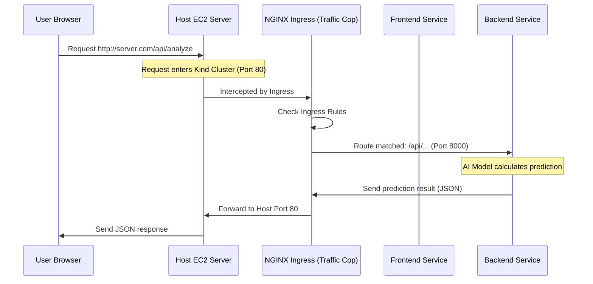

# Chapter 6: Kubernetes Kind & Ingress Layer

Welcome to Chapter 6! We have successfully built our application's "brain" ([BERT Classifier Core Logic](01_bert_classifier_core_logic_.md)), wrapped it in a fast web service ([FastAPI Backend & API Gateway](03_fastapi_backend___api_gateway_.md)), and added real-time monitoring ([Observability Stack (Prometheus & Grafana)](05_observability_stack__prometheus___grafana__.md)).

Now, we need a reliable, industrial-strength environment to run all these separate services together. This is the job of **Kubernetes (K8s)**, and in this project, we use a cost-effective simulation tool called **Kind** and the essential traffic manager known as the **Ingress Layer**.

## 1. The Need for Kubernetes (and Kind)

Running a simple web service might just require one server. But our project has many moving parts:

1.  The FastAPI **Backend** (running the AI).
2.  The web application **Frontend**.
3.  The **Prometheus** metrics collector.
4.  The **Grafana** visualization dashboard.
5.  A **MongoDB** database (for history).

Trying to manage all these services on a single operating system is complicated and fragile.

**The Solution:** We use Kubernetes (K8s), a system designed to automatically deploy, scale, and manage multiple applications (called *containers*) reliably.

### Why We Use Kind

Running a full, production-ready Kubernetes cluster in the cloud (like AWS EKS) is often expensive. Since our project runs on a single, cost-effective AWS EC2 server, we use **Kind** (`Kubernetes in Docker`).

| Feature | Description | Benefit |
| :--- | :--- | :--- |
| **Kind** | Simulates a full K8s cluster inside a single Docker container. | Keeps cloud costs extremely low while still providing all K8s features (like service discovery). |
| **Service Discovery** | K8s assigns stable internal network names (e.g., `backend:8000`). | Services can easily find each other without knowing specific IP addresses. |

Kind allows us to practice deploying our entire complex application stack exactly as we would in a large company, but on a tiny budget.

## 2. Introducing the Ingress Layer (The Traffic Cop)

Once our services are running inside the Kind cluster (Backend, Frontend, etc.), they are hidden from the outside world. They have internal, ever-changing IP addresses that a user's web browser can't reach.

We need a stable front door—a **Traffic Cop**—that manages all external requests coming into the server (usually on ports 80 or 443). This is the **Ingress Layer**.

The Ingress layer in our project uses **NGINX**, a very fast piece of software, to act as the traffic cop.

### The Problem Ingress Solves

When a user types your application's URL, the request hits the server. The server needs to know:
*   Should I show the user the website (Frontend)?
*   Should I send the user's request to the AI model (Backend)?

The Ingress layer checks the URL path and directs the traffic to the correct internal service.

## 3. How Ingress Routes External Traffic

The core job of Ingress is **Path-Based Routing**. It looks at the structure of the URL and decides which internal Kubernetes Service gets the request.

We define these rules using a Kubernetes configuration file (`k8s/ingress/ingress.yaml`).

| Incoming URL | Traffic Rule (Path) | Destination Service |
| :--- | :--- | :--- |
| `http://detector.com/` | `/` (Root path) | `frontend` (Port 80) |
| `http://detector.com/api/analyze` | `/api/...` | `backend` (Port 8000) |
| `http://detector.com/metrics` | `/metrics` | `prometheus` (Port 9090) |

### The Ingress Configuration

Here is how we translate these rules into the Ingress resource definition. This configuration tells NGINX how to behave:

```yaml
# k8s/ingress/ingress.yaml (Core Routing Snippet)
kind: Ingress
# ... (metadata skipped) ...
spec:
  rules:
  - http:
      paths:
      # 1. API Path Rule: Route /api requests to the backend service
      - path: /api(/|$)(.*)
        pathType: ImplementationSpecific
        backend:
          service:
            name: backend
            port:
              number: 8000
      # 2. Root Path Rule: Route all other requests (/) to the frontend
      - path: /
        pathType: Prefix
        backend:
          service:
            name: frontend
            port:
              number: 80
```

**What happens here:**

1.  If the path starts with `/api` (e.g., `/api/analyze`), the request is forwarded internally to the Kubernetes service named `backend` on its internal port 8000 (where FastAPI is listening).
2.  If the path is just `/` (or any path not matching `/api`), it is sent to the `frontend` service on its internal port 80.

This separation is critical because the Frontend only serves HTML/JavaScript, while the Backend uses expensive CPU resources to run the BERT model.

## 4. The End-to-End Request Flow

When a user interacts with our detector, the Ingress layer ensures the request always reaches the correct component, even though the user only sees one public server address.

This diagram illustrates how a single web request from the user's browser is managed by the Ingress layer inside our Kind cluster:



This flow demonstrates the power of Ingress: it provides a stable public interface while keeping the complex internal network structure hidden and flexible.

## Conclusion and Next Steps

We have defined the foundation of our production environment:
1.  **Kind** provides a cheap, full simulation of a Kubernetes cluster on our single cloud server.
2.  The **Ingress Layer** (NGINX) acts as a smart traffic cop, using path-based routing (`/` vs. `/api`) to direct external user requests to the correct internal service (Frontend or Backend).

With our application and infrastructure defined, the final step is automating the deployment process. In the next chapter, we will introduce **ArgoCD**, a powerful tool that uses GitOps principles to manage and update our entire application automatically.

[Chapter 7: ArgoCD GitOps Configuration](07_argocd_gitops_configuration_.md)

---