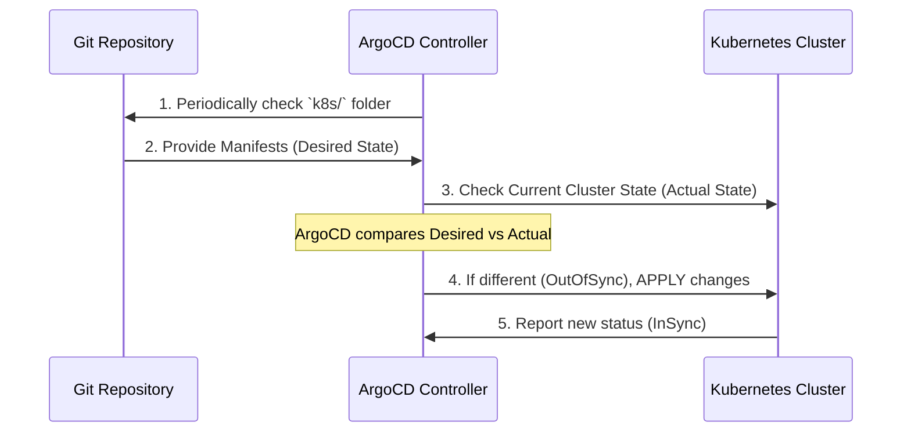

# Chapter 7: ArgoCD GitOps Configuration

Welcome to Chapter 7! In the previous chapter, we finalized our running environment using [Kubernetes Kind & Ingress Layer](06_kubernetes_kind___ingress_layer_.md). We now have an entire application ecosystem defined by YAML files inside our `k8s/` directory: deployments for the backend, frontend, monitoring tools, and the traffic rules for the Ingress.

But here is the catch: If you want to update your FastAPI backend (say, to use a newer version of the BERT model), you have to manually:
1. Edit the YAML file in Git.
2. Run `kubectl apply` on the server.
3. Check the status manually.

This manual process is slow and introduces errors. We need a system that constantly watches our Git repository and automatically updates the cluster whenever we commit a change.

This system is **ArgoCD**, and the methodology is called **GitOps**.

## 1. What Problem Does ArgoCD Solve?

ArgoCD acts as the continuous deployment brain and guarantees consistency between your code repository (Git) and your running application (Kubernetes).

Imagine Git is the master blueprint for your house. If the blueprint says the roof must be blue, but someone paints it red, ArgoCD is the robot janitor who immediately detects the difference and automatically repaints the roof blue.

| If you deploy manually... | With ArgoCD (GitOps)... |
| :--- | :--- |
| **Error-Prone:** You might forget a step or apply the wrong file. | **Automated:** Updates happen instantly upon Git commit. |
| **Drift Risk:** A colleague might manually change a setting in the cluster (e.g., scale up a pod) that is not recorded anywhere. | **Self-Healing:** ArgoCD detects this "drift" and automatically reverts the cluster to match the state defined in Git. |

## 2. Key Concept: Git as the Single Source of Truth

The fundamental principle of GitOps is simple: **Git is the one and only source of truth.**

1.  **Desired State:** The configuration files (`deployment.yaml`, `service.yaml`) in your `k8s/` directory define the *desired state* of the application (e.g., "I want 3 backend replicas running image version `v1.2`").
2.  **Actual State:** The current state of your running Kubernetes cluster.

ArgoCD’s job is to constantly compare the Desired State (Git) with the Actual State (Cluster) and resolve any difference by forcing the cluster to match Git.

## 3. ArgoCD in Action: The Sync Cycle

ArgoCD runs inside your Kubernetes cluster and continually performs this check:



If you commit a change to GitHub, ArgoCD detects that the cluster is now **OutOfSync** and performs an automatic, orchestrated update (**Sync**).

## 4. The App-of-Apps Pattern (Organization)

Our project is complex, involving many different components: the `backend`, `frontend`, `ingress`, and `monitoring` tools (Prometheus/Grafana). Each component requires its own set of YAML files.

If we treat each component as a separate ArgoCD Application, we would have to register four separate apps in ArgoCD. This is manageable but messy.

The **App-of-Apps** pattern simplifies this by creating a single, controlling application (the **Parent**) that manages the deployment of all other applications (the **Children**).

### 4.1. Defining the Parent Application

The parent application, defined in `k8s/argocd/applications.yaml`, points to the root of our `k8s/` directory. ArgoCD reads this folder and sees definitions for all the child applications.

```yaml
# Simplified Parent Application (The Orchestrator)
apiVersion: argoproj.io/v1alpha1
kind: Application
metadata:
  name: fake-news-detector
  namespace: argocd
spec:
  project: fake-news-detector
  source:
    repoURL: <YOUR_REPO_URL>
    targetRevision: main
    path: k8s # <-- Tells ArgoCD to look at the whole k8s folder
  destination:
    server: https://kubernetes.default.svc
    namespace: argocd
```
When this parent app syncs, it creates all the child applications (backend, frontend, monitoring) within ArgoCD.

### 4.2. Defining Child Applications

Each child application targets only the specific folder it needs to manage. For example, the backend application only cares about the files inside `k8s/backend`.

```yaml
# Simplified Child Application (The Backend Deployment)
apiVersion: argoproj.io/v1alpha1
kind: Application
metadata:
  name: fake-news-backend
  namespace: argocd
spec:
  project: fake-news-detector
  source:
    repoURL: <YOUR_REPO_URL>
    targetRevision: main
    path: k8s/backend # <-- Only manages this sub-folder
  destination:
    server: https://kubernetes.default.svc
    namespace: fake-news-app
  syncPolicy:
    automated:
      prune: true
      selfHeal: true
```
The critical part here is `syncPolicy: automated`. This tells ArgoCD: "If you ever see a change in the `k8s/backend` folder of the Git repository, apply that change to the cluster immediately and automatically."

## 5. How ArgoCD Automates an Update

Let’s trace the process when we update our AI model:

**Goal:** Update the FastAPI backend to use Docker image version `v2.0` instead of `v1.0`.

1.  **Developer Action:** The developer changes one line in `k8s/backend/deployment.yaml` in Git:
    ```yaml
    # k8s/backend/deployment.yaml snippet
    image: myrepo/ai-detector-backend:v2.0 # <-- Changed from v1.0
    ```
2.  **Commit and Push:** The developer commits this change to the `main` branch.
3.  **ArgoCD Scrape:** ArgoCD checks the Git repository every few minutes and sees the update in the `k8s/backend` directory.
4.  **OutOfSync Detection:** ArgoCD marks the `fake-news-backend` application as **OutOfSync** because the cluster is running `v1.0` but Git demands `v2.0`.
5.  **Automatic Sync:** Due to the `automated` policy, ArgoCD immediately applies the new `deployment.yaml` to the cluster. Kubernetes starts a rolling update, replacing the old `v1.0` pods with new `v2.0` pods gracefully.
6.  **InSync State:** Once the `v2.0` pods are running and healthy, ArgoCD marks the application as **InSync**.

The entire deployment happens without a single manual `kubectl` command. This stability is crucial for running complex applications like our confidence-aware [FastAPI Backend & API Gateway](03_fastapi_backend___api_gateway_.md).

## Conclusion and Next Steps

ArgoCD implements the powerful GitOps philosophy, transforming our set of configuration files into a dynamic deployment system. By setting up the App-of-Apps pattern, we efficiently manage all components of our detector—backend, frontend, and the [Observability Stack (Prometheus & Grafana)](05_observability_stack__prometheus___grafana__.md)—with guaranteed consistency. Our cluster state is now securely defined, managed, and healed by Git.

We have now fully defined *how* our application runs (Kubernetes/ArgoCD) and *what* it does (BERT model). The final piece of the puzzle is provisioning the actual cloud infrastructure—the server, the network, and the databases—that hosts all this technology. In the next chapter, we will use Terraform to define our AWS infrastructure as code.

[Chapter 8: Terraform AWS Provisioning](08_terraform_aws_provisioning_.md)

---
