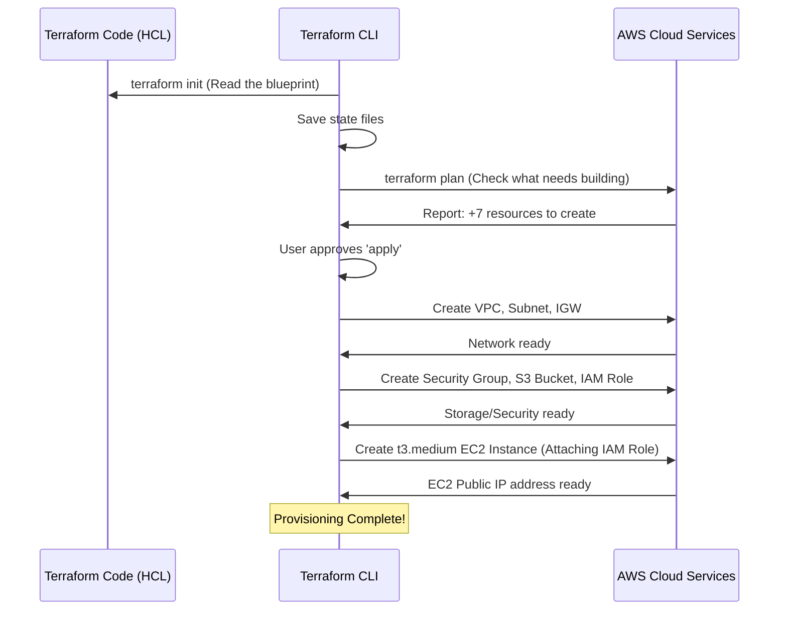

# Chapter 8: Terraform AWS Provisioning

Welcome to the final infrastructure chapter! We have spent the last seven chapters building our application, defining the CI/CD pipeline ([ArgoCD GitOps Configuration](07_argocd_gitops_configuration_.md)), and mapping out our complex runtime environment using Kubernetes.

All these systems—the FastAPI backend, the BERT classifier, Prometheus, Grafana, and ArgoCD—require a physical home to run reliably on the internet.

This chapter defines **Terraform AWS Provisioning**, which is the process of automatically building that home in the Amazon Web Services (AWS) cloud using code.

## 1. The Core Problem: Building the Cloud Home

If we had to manually set up our cloud environment—clicking to create a network, selecting a server size, and configuring the firewall rules—it would take hours, be prone to human errors, and would be impossible to reproduce reliably.

**The Solution: Infrastructure as Code (IaC)**

We use **Terraform**, a tool that allows us to write an **Architect's Blueprint** for our cloud resources. Instead of clicking buttons in the AWS console, we write simple configuration files (using a language called HCL) that describe *exactly* what we want.

Terraform reads this blueprint and handles all the steps necessary to build, update, or destroy the infrastructure on AWS.

| Manual Cloud Setup | Terraform (IaC) |
| :--- | :--- |
| Click, click, click... (Slow and error-prone) | Write the blueprint once. (Fast and repeatable) |
| Hard to replicate the exact setup later. | **Idempotent:** Running the code twice yields the exact same, correct result. |
| Configuration is hidden in the cloud console. | Configuration is version-controlled in Git. |

## 2. Our Infrastructure Blueprint

Our detector application needs three core infrastructure components from AWS, all defined in the `infra/terraform` directory:

| Component | Terraform Resource | Purpose in Project |
| :--- | :--- | :--- |
| **Network (VPC)** | `aws_vpc`, `aws_subnet` | Creates the fenced-off private property for our server. |
| **Server (EC2)** | `aws_instance` | The specific Ubuntu Virtual Machine hosting the entire [Kubernetes Kind & Ingress Layer](06_kubernetes_kind___ingress_layer_.md). |
| **Storage (S3)** | `aws_s3_bucket` | The secure warehouse where the massive BERT model artifact lives, supporting [Cloud Model Management (S3 MLOps)](04_cloud_model_management__s3_mlops__.md). |
| **Security** | `aws_security_group`, `aws_iam_role` | The firewall and the "secretless" identity badge for S3 access. |

## 3. The Terraform Workflow

Using Terraform is a simple, three-step process executed via command line in the `infra/terraform` directory:

### Step 1: `terraform init` (Prepare)

This command initializes Terraform, downloads the necessary AWS plugins (called **providers**), and prepares the environment.

### Step 2: `terraform plan` (Review)

This is the most critical step. Terraform reads your code files (`.tf`) and contacts AWS to figure out the **difference** between your blueprint (Desired State) and what currently exists in the cloud (Actual State).

It outputs a detailed list of actions:
*   `+ 3 to add` (e.g., creating the VPC, the server, and the S3 bucket)
*   `~ 1 to change` (e.g., updating the size of the existing server)
*   `- 0 to destroy`

You review the plan to ensure you aren't accidentally deleting anything important.

### Step 3: `terraform apply` (Build)

If the plan looks correct, the `apply` command executes the changes. Terraform sends the necessary API calls to AWS, and AWS begins creating the infrastructure resources defined in your blueprint.

## 4. Building the Kind Server (EC2)

Our entire application runs on one dedicated virtual machine (EC2 instance) large enough to handle the Kubernetes cluster, Prometheus, and the memory requirements of the BERT model.

We define this instance in `infra/terraform/ec2.tf`. Notice the specific size we choose: `t3.medium`. This is an essential detail!

```hcl
# infra/terraform/ec2.tf (The server definition)
resource "aws_instance" "server" {
  ami           = data.aws_ami.ubuntu.id
  instance_type = "t3.medium" # Requires sufficient memory for BERT and Kind!

  # Networking and security configuration
  subnet_id = aws_subnet.public.id
  vpc_security_group_ids = [aws_security_group.web_sg.id]
  # ... other configurations ...
  
  tags = {
    Name = "ai-fake-news-detector-server"
  }
}
```

The output of this deployment gives us the public IP address of the server, which is immediately used by other automation tools (like Ansible, referenced in the `setup.sh` script) to install Docker, Kind, and ArgoCD.

## 5. Setting up Storage and Security

Terraform handles two other critical resources:

### 5.1. The Security Group (The Firewall)

The security group (`infra/terraform/sg.tf`) is the digital firewall. It defines which internet ports are open. If we don't open the ports, the user's web browser can't reach our application.

We specifically open ports 22 (SSH for management), 80 (HTTP for user access), and 443 (HTTPS).

### 5.2. The S3 Model Bucket and IAM Role

As we learned in [Chapter 4: Cloud Model Management (S3 MLOps)](04_cloud_model_management__s3_mlops__.md), our backend service needs to download the BERT model from a private S3 bucket without using any secrets.

Terraform handles both the creation of the storage and the permission system:

1.  **S3 Bucket Creation:** The `aws_s3_bucket` resource creates the dedicated warehouse.
2.  **IAM Role Creation:** The `aws_iam_instance_profile` resource creates the secure ID badge and attaches it directly to our EC2 server.

This entire setup guarantees the "secretless" connection required for robust MLOps security.

## 6. The Full Infrastructure Provisioning Flow

Terraform is the foundation upon which all our advanced systems are built.



Once Terraform completes the `apply` step, it outputs the public IP address. At this point, the server is just a raw Ubuntu operating system. The next stage, handled by tools like Ansible (as referenced in the `setup.sh` file), takes over to install the software (Docker, Kind, ArgoCD) and use the `aws_s3_bucket` and public IP address generated by Terraform.

## Conclusion and Project Summary

Terraform provides the essential, repeatable foundation for our project. By using Infrastructure as Code, we ensured that the network, the powerful server hosting Kubernetes, and the secure model storage (S3 with IAM Roles) are always provisioned correctly, reliably, and consistently.

With this final chapter, the loop is complete. We started with the core AI logic (BERT), built the application around it (FastAPI), secured its model deployment (S3 MLOps), instrumented monitoring (Prometheus/Grafana), wrapped it in a self-healing deployment pipeline (Kind/ArgoCD), and finally, defined its physical home (Terraform on AWS).

This comprehensive project demonstrates a full-stack, production-ready machine learning application lifecycle, from model code to cloud infrastructure.

[Chapter 9: Ansible Configuration Management](09_ansible_configuration_management.md)

---