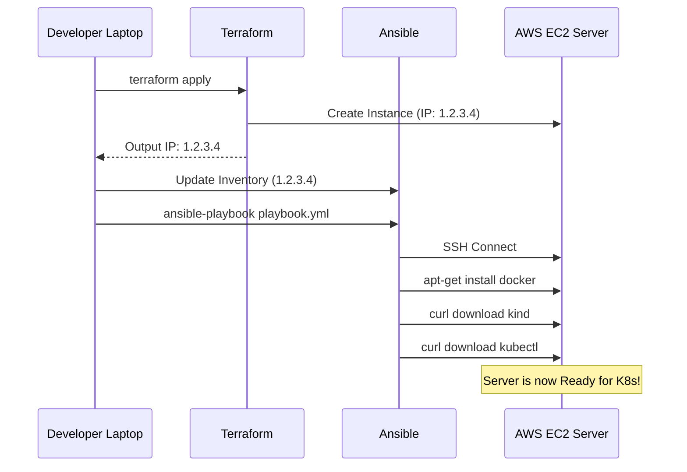

# Chapter 9: Ansible Configuration Management

Welcome to Chapter 9! In [Chapter 8: Terraform AWS Provisioning](08_terraform_aws_provisioning_.md), we used Terraform to create the physical infrastructure—the Virtual Machine (EC2), the Network (VPC), and the Security Groups.

But there is a gap. Terraform gives us a **blank** Ubuntu server. It doesn't have Docker, it doesn't have Kubernetes, and it doesn't know how to run our application.

This chapter introduces **Ansible**, the Configuration Management tool that acts as the "sysadmin robot," logging into our blank server and installing all the necessary software to make it production-ready.

## 1. The Core Problem: The "Blank Slate"

After Terraform finishes, we have a raw Linux server. To run our [Kubernetes Kind Cluster](06_kubernetes_kind___ingress_layer_.md), we need to manually:
1.  Update the OS (`apt-get update`).
2.  Install Docker (the engine).
3.  Install specific tools: `kubectl`, `kind`, `argocd`.
4.  Configure user permissions.

Doing this manually for every deployment is slow and inconsistent.

**The Solution: Ansible**

Ansible allows us to write a "Playbook" (a list of tasks) that describes the desired state of the server. It connects via SSH (just like we do) and executes these tasks automatically.

| Manual Setup | Ansible Automation |
| :--- | :--- |
| SSH in, run commands one by one. | Run one command: `ansible-playbook`. |
| Easy to forget a step (e.g., adding user to docker group). | **Codified:** Every step is written in YAML. |
| Time consuming. | **Fast:** Installs everything in parallel where possible. |

## 2. Our Ansible Architecture

Our Ansible configuration lives in `infra/ansible` and follows a standard, modular structure:

*   **Inventory**: A file listing the IP addresses of our servers.
*   **Playbook**: The master to-do list (`playbook.yml`).
*   **Roles**: Specialized folders for specific tasks (e.g., "Install Docker", "Setup Kubernetes").

### 2.1. The Inventory (Connecting Terraform to Ansible)

Ansible needs to know *where* to connect. Since Terraform creates the server and generates a new IP address every time, we typically update the `inventory.ini` file with the dynamic IP from Terraform.

```ini
# infra/ansible/inventory.ini (Example)
[webservers]
13.234.186.178 ansible_user=ubuntu ansible_ssh_private_key_file=../terraform/ai-fake-news-detector-key.pem
```

## 3. The Playbook Layers (Roles)

Our `playbook.yml` is the orchestrator. It tells Ansible: "Connect to all hosts in the inventory and apply these roles."

```yaml
# infra/ansible/playbook.yml
---
- hosts: all
  become: true  # Run as root (sudo)
  roles:
    - docker      # Step 1: Install Container Engine
    - kubernetes  # Step 2: Install K8s Tools (Kind, Kubectl)
```

### Role 1: Docker (The Foundation)

Before we can run "Kubernetes in Docker" (Kind), we obviously need Docker! The `docker` role handles the complex process of setting up the repository, installing the package, and starting the service.

```yaml
# infra/ansible/roles/docker/tasks/main.yml (Simplified)
- name: Install Docker dependencies
  apt:
    pkg: [apt-transport-https, ca-certificates, curl, software-properties-common]

- name: Add Docker GPG key
  apt_key:
    url: https://download.docker.com/linux/ubuntu/gpg

- name: Install Docker Engine
  apt:
    name: docker-ce
    state: present
```

### Role 2: Kubernetes Tooling (The Bootstrap)

This project relies on specific binary tools to manage the cluster. The `kubernetes` role downloads these binaries directly to `/usr/local/bin` so they are available globally.

```yaml
# infra/ansible/roles/kubernetes/tasks/main.yml
- name: Download Kind binary
  get_url:
    url: https://kind.sigs.k8s.io/dl/v0.20.0/kind-linux-amd64
    dest: /usr/local/bin/kind
    mode: '0755'

- name: Download Kubectl
  get_url: ...

- name: Download ArgoCD CLI
  get_url: ...
```

This role ensures that when we SSH into the server, we can immediately type `kurtctl get pods` or `argocd app list` without any "command not found" errors.

## 4. The Bridge: From Raw Hardware to K8s Cluster

Ansible is the vital bridge in our deployment process.

1.  **Hardware (Terraform):** Creates the empty House (Server).
2.  **Configuration (Ansible):** Installs the Plumbing and Electricity (Docker, OS tools).
3.  **Application (Kubernetes):** Moves in the Furniture and Residents (Pods, Services).



## Conclusion

By adding **Ansible** to our stack, we have achieved fully automated **Configuration Management**. We no longer treat our servers like "pets" (nursing them manually); we treat them like "cattle" (replacable and automated).

If our server crashes, we can use Terraform to create a new one and Ansible to configure it in minutes, ensuring our [GitOps Pipeline](07_argocd_gitops_configuration_.md) has a perfectly prepared environment to deploy our AI detector.

**This concludes the technical documentation of the AI Fake News Detector.**
You have now traversed the entire journey: from BERT logic, to FastAPI, MLOps, Observability, K8s Architecture, GitOps, Infrastructure, and finally, Server Automation.
